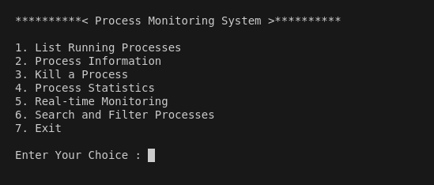
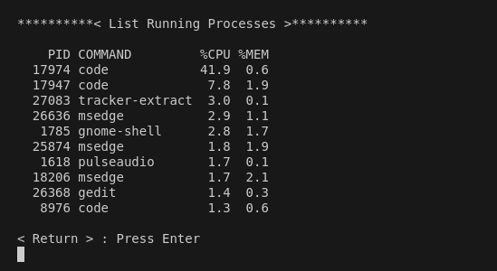
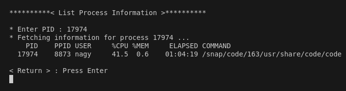
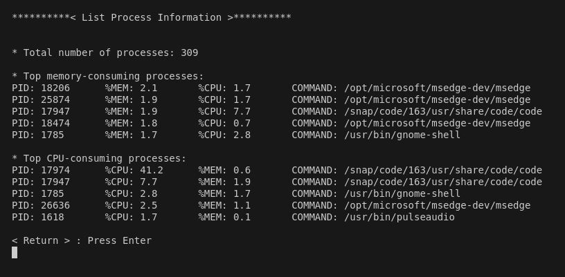
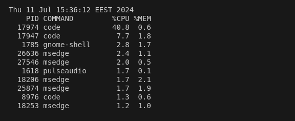
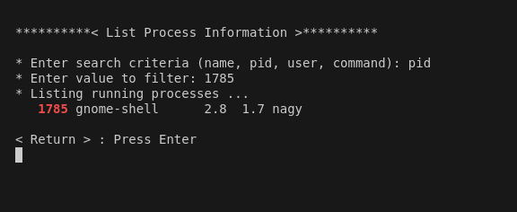
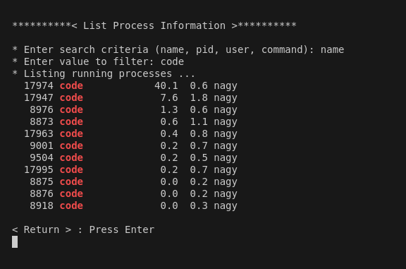

# ProcessesMonitoringSystem

## Project Overview
Create a Bash script that serves as a simple process monitor, allowing users to view, manage, and analyze running processes on a Unix-like system.

## Features
- 1. List Running Processes :
	Implement functionality to list all running processes with essential information (PID, name, CPU/Memory usage).
	
- 2. Process Information :
	Provide detailed information about a specific process, including its PID, parent process ID, user, CPU and memory usage, etc.
	
- 3. Kill a Process :
	Allow users to terminate a specific process by entering its PID.

- 4. Process Statistics :
	Display overall system process statistics, such as the total number of processes, memory usage, and CPU load.
	
- 5. Real-time Monitoring :
	Implement real-time monitoring, updating the display at regular intervals to show the latest process information.	
	
- 6. Search and Filter :
	Allow users to search for processes based on criteria such as name, user, or resource usage.

- 7. Interactive Mode :
	Implement an interactive mode where users can choose operations from a menu.
	
	
## Configuration File
- Allow users to configure the script through a configuration file. For example, users might specify the update interval, alert thresholds, etc.

- Users can create a configuration file (e.g., process_monitor.conf) with settings included.

## Sample From the Output

